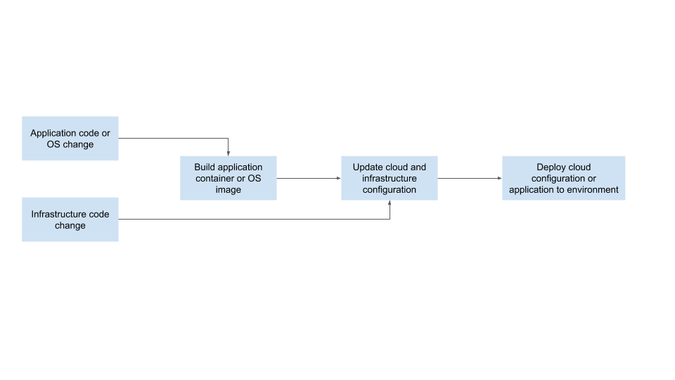

## Exercise 5 - Designing a DevSecOps Pipeline

Take a look at a very common deployment pipeline diagrammed below:

The high-level steps are as follows:

1. The user makes a change to the application code or OS configuration for a service.
2. Once the change is committed to source, a build is kicked off resulting in an AMI or a container image.
3. The infrastructure as code is updated with the new AMI or container image to use.
4. Changes to cloud configuration or infrastructure as code may have also been committed.
5. A deployment to the environment ensues applying the changes

**_Deliverables for Exercise 5:_**
- **DevSecOpsPipline.[ppt or png]** - Your updated pipeline.
- **E5T2.txt** - Answer from prompts in Exercise 5, Task 2.
- *Optional* **E5T3.png** - Screenshot of tool that has identified bad practices.
- *Optional* **E5T3.txt** - Answers from prompts in Exercise 5, Task 3.

### Task 1:  Design a DevSecOps pipeline

Update the starter DevOpsPipeline.ppt (or create your own diagram using a different tool)
At minimum you will include steps for:
- Infrastructure as code compliance scanning.
- AMI or container image scanning.
- Post-deployment compliance scanning.

Submit your design as a ppt or png image named DevSecOpsPipeline.[ppt or png].

**Deliverables**:
- **DevSecOpsPipline.[ppt or png]** - Your updated pipeline.

### Task 2 - Tools and Documentation
      
You will need to determine appropriate tools to incorporate into the pipeline to ensure that security vulnerabilities are found.

1. Identify tools that will allow you to do the following:
 a. Scan infrastructure as code templates.
 b. Scan AMI’s or containers for OS vulnerabilities.
 c. Scan an AWS environment for cloud configuration vulnerabilities.
2. For each tool - identify an example compliance violation or vulnerability which it might expose.

Submit your answers in E5T2.txt

**Deliverables**:
- **E5T2.txt** - Answer from prompts in Exercise 5, Task 2.

### _Optional Standout Suggestion_ Task 3 - Scanning Infrastructure Code

- Run an infrastructure as code scanning tool on the cloud formation templates provided in the starter.
- Take a screenshot of the tool that has correctly identified bad practices.
- If you had completed the remediations by updating the cloud formation templates, run the scanner and compare outputs showing that insecure configurations were fixed.

**Deliverables**:
- _Optional_ **E5T3.png** - Screenshot of tool that has identified bad practices.
- _Optional_ **E5T3.txt** - Answers from prompts in Exercise 5, Task 3.